**Version:** 2.0  
**Last Updated:** February 05, 2026  
**Total Tables:** 16

---

## Visual ERD (Mermaid Diagram)

```mermaid
erDiagram
    %% ==================== CORE RELATIONSHIPS ====================
    
    User ||--o{ Loan : "borrows"
    User ||--o{ Reservation : "reserves"
    User ||--o{ Fine : "has"
    User ||--o{ Review : "writes"
    User ||--o{ ReadingHistory : "tracks"
    User ||--o| UserGamification : "has"
    User ||--o{ Notification : "receives"
    User ||--o{ BookRequest : "requests"
    
    Book ||--o{ Loan : "borrowed_in"
    Book ||--o{ Reservation : "reserved_in"
    Book ||--o{ Review : "has"
    Book ||--o{ DamageReport : "has"
    Book ||--o{ BookSuggestion : "suggested_as"
    
    Loan ||--o{ Fine : "may_incur"
    
    BookRequest }o--|| Book : "becomes"
    
    BookSuggestion }o--|| User : "recommended_to"
    
    %% ==================== USER MANAGEMENT ====================
    
    User {
        uuid id PK
        string email UK "Unique email"
        string phoneNumber UK "Unique phone"
        string password "Hashed password"
        enum role "STUDENT, TEACHER, LIBRARIAN, ADMIN, STAFF"
        enum status "ACTIVE, SUSPENDED, GRADUATED, INACTIVE"
        string firstName
        string lastName
        string admissionNumber UK "Student ID"
        string employeeId UK "Staff ID"
        int grade "1-13 for students"
        string classSection "e.g., 10A"
        enum-array teachingSubjects "NEW - Subjects taught"
        string department "NEW - Department name"
        string profileImageUrl "NEW - Profile image"
        date dateOfBirth "NEW - Date of birth"
        string address
        string emergencyContact
        string cardNumber UK "Library card"
        string cardQrCode "QR code data"
        boolean emailVerified
        datetime lastLogin
        datetime createdAt
        datetime updatedAt
    }
    
    %% ==================== BOOK CATALOG ====================
    
    Book {
        uuid id PK
        string isbn13 UK
        string isbn10
        string barcode UK
        string title
        string subtitle
        array authors
        string publisher
        string publishedDate
        string language
        int pageCount
        array categories
        array subjects
        array localSubjects "NEW - Sri Lankan subjects"
        string deweyDecimal
        text description
        string coverImageUrl
        string thumbnailUrl
        string edition
        string binding
        string dimensions
        string weight
        string targetAudience "NEW - Target audience"
        string ageRange "NEW - Age range"
        string seriesName "NEW - Series name"
        int volumeNumber "NEW - Volume number"
        string donatedBy "NEW - Donor name"
        boolean isDonation "NEW - Donation flag"
        array tags "NEW - Search tags"
        string accessionNumber UK
        string location
        date purchaseDate
        decimal purchasePrice
        string vendor
        enum status
        enum condition
        int totalCopies
        int availableCopies
        int totalLoans
        int totalReservations
        datetime lastBorrowed
        float popularity
        datetime createdAt
        datetime updatedAt
        string createdBy
    }
    
    %% ==================== CIRCULATION ====================
    
    Loan {
        uuid id PK
        uuid userId FK
        uuid bookId FK
        datetime checkoutDate
        datetime dueDate
        datetime returnDate
        enum status
        int renewalCount
        int maxRenewals
        string checkedOutBy
        string checkedInBy
        enum checkoutCondition
        enum returnCondition
        string notes
        boolean overdueNoticeSent
        datetime overdueNoticeDate
        datetime createdAt
        datetime updatedAt
    }
    
    %% ==================== RESERVATIONS ====================
    
    Reservation {
        uuid id PK
        uuid userId FK
        uuid bookId FK
        datetime requestDate
        datetime availableDate
        datetime expiryDate
        datetime claimDate
        enum status
        int queuePosition
        boolean notificationSent
        datetime createdAt
        datetime updatedAt
    }
    
    %% ==================== FINES & PENALTIES ====================
    
    Fine {
        uuid id PK
        uuid userId FK
        uuid loanId FK
        enum type
        decimal amount
        decimal amountPaid
        enum status
        int daysOverdue
        decimal dailyRate
        datetime paidDate
        string paymentMethod
        string receiptNumber
        string waivedBy
        string waiverReason
        datetime waivedDate
        string description
        datetime createdAt
        datetime updatedAt
    }
    
    %% ==================== DAMAGE TRACKING ====================
    
    DamageReport {
        uuid id PK
        uuid bookId FK
        string reportedBy
        enum severity
        text description
        array images
        decimal repairCost
        datetime repairDate
        boolean withdrawn
        datetime reportDate
        datetime createdAt
        datetime updatedAt
    }
    
    %% ==================== REVIEWS & RATINGS ====================
    
    Review {
        uuid id PK
        uuid userId FK
        uuid bookId FK
        int rating "1-5 stars"
        text comment
        boolean approved
        string moderatedBy
        datetime moderatedAt
        datetime createdAt
        datetime updatedAt
    }
    
    %% ==================== READING HISTORY ====================
    
    ReadingHistory {
        uuid id PK
        uuid userId FK
        string bookId "Denormalized"
        string bookTitle "Denormalized"
        array bookAuthors "Denormalized"
        array bookCategories "Denormalized"
        datetime borrowDate
        datetime returnDate
        int rating
        datetime createdAt
    }
    
    %% ==================== GAMIFICATION ====================
    
    UserGamification {
        uuid id PK
        uuid userId FK "UNIQUE"
        int currentStreak
        int longestStreak
        datetime lastBorrowDate
        int totalBooksRead
        int totalGenres
        int totalReviews
        int points
        int level
        array badges
        int gradeRank
        int schoolRank
        boolean optedInLeaderboard
        datetime updatedAt
    }
    
    %% ==================== DIGITAL VAULT ====================
    
    VaultResource {
        uuid id PK
        string title
        text description
        enum type
        int grade "1-13"
        string subject
        int year
        string medium
        string fileUrl
        string fileName
        int fileSize
        string mimeType
        boolean isPublic
        int downloadCount
        int viewCount
        string source
        string sourceUrl
        string uploadedBy
        datetime createdAt
        datetime updatedAt
    }
    
    %% ==================== NOTIFICATIONS ====================
    
    Notification {
        uuid id PK
        uuid userId FK
        enum type
        enum channel
        string title
        text message
        string actionUrl
        boolean sent
        datetime sentAt
        boolean read
        datetime readAt
        int retryCount
        datetime lastRetry
        datetime createdAt
    }
    
    %% ==================== ANALYTICS ====================
    
    DailyStatistics {
        uuid id PK
        date date UK
        int totalCheckouts
        int totalReturns
        int newReservations
        int activeUsers
        int newUsers
        decimal finesCollected
        int vaultDownloads
        int vaultViews
        datetime createdAt
    }
    
    %% ==================== SYSTEM CONFIGURATION ====================
    
    SystemConfig {
        uuid id PK
        int maxLoansPerStudent
        int maxLoansPerTeacher
        int loanDurationDays
        int maxRenewals
        decimal overdueFinePerDay
        decimal maxFineAmount
        decimal damageFinePenalty
        int reservationClaimHours
        int maxActiveReservations
        int dueDateReminderDays
        boolean enableSmsNotifications
        boolean enableEmailNotifications
        boolean enablePushNotifications
        int pointsPerBorrow
        int pointsPerReview
        int pointsPerStreak
        datetime updatedAt
        string updatedBy
    }
    
    %% ==================== NEW TABLES ====================
    
    BookRequest {
        uuid id PK
        uuid userId FK
        string title "Requested book title"
        string author
        string isbn
        text reason "Request justification"
        int priority "1-5"
        enum status "PENDING, APPROVED, REJECTED, ORDERED, RECEIVED"
        string reviewedBy
        datetime reviewedAt
        text reviewNotes
        datetime orderedDate
        datetime receivedDate
        uuid bookId FK "Link to created book"
        datetime requestDate
        datetime createdAt
        datetime updatedAt
    }
    
    BookSuggestion {
        uuid id PK
        uuid userId FK "NULL for general suggestions"
        uuid bookId FK
        string reason "Why recommended"
        decimal score "0-100 confidence"
        array basedOn "Recommendation factors"
        boolean shown
        boolean clicked
        boolean borrowed
        datetime createdAt
        datetime expiresAt
    }
    
    Announcement {
        uuid id PK
        string title
        text message
        enum type "GENERAL, MAINTENANCE, NEW_ARRIVALS, EVENT, POLICY_CHANGE"
        array targetRoles "Empty = all users"
        array targetGrades "Empty = all grades"
        boolean isPinned
        datetime showUntil
        string createdBy
        datetime createdAt
        datetime updatedAt
    }
```



---

## Simplified Relationship Overview

```
┌─────────────────────────────────────────────────────────────┐
│                        CORE SYSTEM                          │
├─────────────────────────────────────────────────────────────┤
│                                                             │
│  ┌────────┐         ┌────────┐         ┌──────────┐       │
│  │  User  │────┬────│  Book  │────┬────│   Loan   │       │
│  └────────┘    │    └────────┘    │    └──────────┘       │
│       │        │         │         │          │            │
│       │        │         │         │          │            │
│       ├────────┼─────────┼─────────┤          │            │
│       │        │         │         │          │            │
│       ▼        ▼         ▼         ▼          ▼            │
│  ┌──────────────────────────────────────────────────┐      │
│  │  Reservation │ Review │ Fine │ DamageReport      │      │
│  └──────────────────────────────────────────────────┘      │
│                                                             │
└─────────────────────────────────────────────────────────────┘

┌─────────────────────────────────────────────────────────────┐
│                    ENGAGEMENT FEATURES                      │
├─────────────────────────────────────────────────────────────┤
│                                                             │
│  User ────> UserGamification (1:1)                         │
│  User ────> ReadingHistory (1:N)                           │
│  User ────> Notification (1:N)                             │
│  User ────> BookRequest (1:N)          ⭐ NEW              │
│  User <──── BookSuggestion (N:1)       ⭐ NEW              │
│                                                             │
└─────────────────────────────────────────────────────────────┘

┌─────────────────────────────────────────────────────────────┐
│                   CONTENT & RESOURCES                       │
├─────────────────────────────────────────────────────────────┤
│                                                             │
│  VaultResource (standalone)                                │
│  Announcement (standalone)              ⭐ NEW              │
│  DailyStatistics (standalone)                              │
│  SystemConfig (singleton)                                  │
│                                                             │
└─────────────────────────────────────────────────────────────┘
```

---

## Table Relationships by Type

### One-to-Many Relationships

|Parent Table|Child Table|Relationship|Foreign Key|Description|
|---|---|---|---|---|
|User|Loan|1:N|userId|User's borrowing history|
|User|Reservation|1:N|userId|User's reservations|
|User|Fine|1:N|userId|User's fines|
|User|Review|1:N|userId|User's book reviews|
|User|ReadingHistory|1:N|userId|User's reading analytics|
|User|Notification|1:N|userId|User's notifications|
|User|BookRequest|1:N|userId|User's book requests ⭐|
|Book|Loan|1:N|bookId|Book's circulation history|
|Book|Reservation|1:N|bookId|Book's reservation queue|
|Book|Review|1:N|bookId|Book's reviews|
|Book|DamageReport|1:N|bookId|Book's damage reports|
|Book|BookSuggestion|1:N|bookId|Book recommendations ⭐|
|Loan|Fine|1:N|loanId|Fines from a loan|
|BookRequest|Book|N:1|bookId|Fulfilled request ⭐|

### One-to-One Relationships

|Table 1|Table 2|Relationship|Foreign Key|Description|
|---|---|---|---|---|
|User|UserGamification|1:1|userId (unique)|User's gamification stats|

### Many-to-Many Relationships

_Note: Currently no direct many-to-many relationships. All are implemented through junction tables or denormalized._

---

## Cascade Behavior

### ON DELETE Actions

|Parent Table|Child Table|ON DELETE|Rationale|
|---|---|---|---|
|User|Loan|RESTRICT|Preserve loan history|
|User|Reservation|CASCADE|Remove pending reservations|
|User|Fine|RESTRICT|Preserve financial records|
|User|Review|CASCADE|Remove user reviews|
|User|ReadingHistory|CASCADE|Remove reading history|
|User|UserGamification|CASCADE|Remove gamification data|
|User|Notification|CASCADE|Remove notifications|
|User|BookRequest|CASCADE|Remove book requests|
|Book|Loan|RESTRICT|Preserve circulation history|
|Book|Reservation|CASCADE|Remove reservations|
|Book|Review|CASCADE|Remove reviews|
|Book|DamageReport|CASCADE|Remove damage reports|
|Book|BookSuggestion|CASCADE|Remove suggestions|
|Loan|Fine|RESTRICT|Preserve fine records|

### ON UPDATE Actions

All foreign keys use `CASCADE` for updates to maintain referential integrity when primary keys change (though UUIDs rarely change).

---

## Index Coverage by Query Pattern

### Common Query Patterns

|Query Pattern|Tables Involved|Indexes Used|Performance|
|---|---|---|---|
|User login (email)|User|idx_user_email (UNIQUE)|O(log n)|
|User login (card scan)|User|idx_user_card (UNIQUE)|O(log n)|
|Book search (title/author)|Book|idx_book_fulltext|O(log n)|
|Book search (ISBN)|Book|idx_book_isbn13 (UNIQUE)|O(log n)|
|Book search (barcode scan)|Book|idx_book_barcode (UNIQUE)|O(log n)|
|Available books|Book|idx_book_status|O(log n)|
|User's active loans|Loan, User, Book|idx_loan_user, idx_loan_status|O(log n)|
|Book's current status|Loan, Book|idx_loan_book, idx_loan_status|O(log n)|
|Overdue loans|Loan|idx_loan_status, idx_loan_due|O(log n)|
|Reservation queue|Reservation, Book|idx_reservation_book|O(log n)|
|User's fines|Fine, User|idx_fine_user, idx_fine_status|O(log n)|
|Book recommendations|BookSuggestion, User|idx_suggestion_user, idx_suggestion_score|O(log n)|
|Pending book requests|BookRequest|idx_request_status|O(log n)|
|Active announcements|Announcement|idx_announcement_pinned, idx_announcement_type|O(log n)|
|Books by series|Book|idx_book_series|O(log n)|
|Teachers by subject|User|idx_user_role_status (composite)|O(log n)|

---

## Data Flow Diagrams

### Book Checkout Flow

```
┌────────┐       ┌────────┐       ┌────────┐
│  User  │──1──> │  Book  │──2──> │  Loan  │
└────────┘       └────────┘       └────────┘
     │                │                │
     │                │                │
     └────────3───────┴────────────────┘
                      ▼
            ┌──────────────────┐
            │ ReadingHistory   │ (created on checkout)
            └──────────────────┘
                      ▼
            ┌──────────────────┐
            │ UserGamification │ (updated)
            └──────────────────┘
                      ▼
            ┌──────────────────┐
            │  Notification    │ (confirmation sent)
            └──────────────────┘

Steps:
1. Verify user eligibility (no unpaid fines, within loan limit)
2. Check book availability (availableCopies > 0)
3. Create Loan record
4. Update Book (decrement availableCopies)
5. Create ReadingHistory entry
6. Update UserGamification (increment points, update streak)
7. Send Notification (checkout confirmation)
```

### Book Return & Reservation Flow

```
┌────────┐       ┌────────┐       ┌─────────────┐
│  Loan  │──1──> │  Book  │──2──> │ Reservation │
└────────┘       └────────┘       └─────────────┘
     │                │                   │
     │                │                   │
     └────────3───────┴───────────────────┘
                      ▼
            ┌──────────────────┐
            │      Fine        │ (if overdue)
            └──────────────────┘
                      ▼
            ┌──────────────────┐
            │  Notification    │ (next in queue)
            └──────────────────┘

Steps:
1. Update Loan (set returnDate, status = RETURNED)
2. Update Book (increment availableCopies)
3. Check if overdue -> Create/Update Fine
4. Check Reservation queue
5. If queue exists -> Update first Reservation (status = AVAILABLE)
6. Send Notification to next user
```

### Book Request Flow

```
┌────────┐       ┌──────────────┐       ┌────────┐
│  User  │──1──> │ BookRequest  │──2──> │  Book  │
└────────┘       └──────────────┘       └────────┘
                        │
                        │
                        └────────3────────────────┐
                                                  ▼
                                        ┌──────────────────┐
                                        │  Notification    │
                                        └──────────────────┘

Steps:
1. User creates BookRequest
2. Librarian reviews (status = APPROVED/REJECTED)
3. If APPROVED -> Order book
4. When received -> Create Book record
5. Link Book to BookRequest (bookId)
6. Update BookRequest (status = RECEIVED)
7. Notify user of availability
```

### Recommendation Generation Flow

```
┌────────┐       ┌──────────────────┐       ┌──────────────────┐
│  User  │──1──> │ ReadingHistory   │──2──> │ BookSuggestion   │
└────────┘       └──────────────────┘       └──────────────────┘
     │                    │                           │
     │                    │                           │
     └────────────────────┴───────────3───────────────┘
                                      ▼
                            ┌──────────────────┐
                            │  Notification    │
                            └──────────────────┘

Steps:
1. Analyze user's ReadingHistory (categories, authors)
2. Find similar books not yet borrowed
3. Calculate recommendation score
4. Create BookSuggestion records
5. Send Notification about new recommendations
```

---

## Database Schema Evolution Plan

### Version 2.0 (Current)

✅ Added 3 new tables: BookRequest, BookSuggestion, Announcement  
✅ Added User fields: teachingSubjects, department, profileImageUrl, dateOfBirth  
✅ Added Book fields: targetAudience, ageRange, seriesName, volumeNumber, donatedBy, isDonation, tags, localSubjects  
✅ Added new enums: Subject, RequestStatus, AnnouncementType

### Version 2.1 (Planned - Q2 2026)

- Add BookCopy table (manage individual book copies)
- Add Vendor table (track book vendors)
- Add Publisher table (normalize publisher data)
- Add Genre table (standardize categories)

### Version 3.0 (Future LMS Integration)

- Add Course table
- Add Assignment table
- Add Grade table
- Add Attendance table
- Add Parent/Guardian table
- Add Class/Section table
- Add Subject curriculum table

---

## Notes

### Design Decisions

1. **UUID vs Auto-increment IDs**: Using UUIDs for better distribution in microservices and avoiding sequential ID enumeration attacks
    
2. **Denormalization in ReadingHistory**: Intentional denormalization for performance in analytics queries without joins
    
3. **Soft Deletes**: Using status enums instead of hard deletes to preserve historical data
    
4. **Array Fields**: PostgreSQL arrays for multi-value fields (authors, categories, tags) for better query performance than junction tables
    
5. **One Gamification Record**: Each user has exactly one UserGamification record for faster leaderboard queries
    
6. **No Direct User-Book Relationship**: All user-book interactions go through Loan, Reservation, or Review for proper audit trail
    

### Performance Considerations

- **Full-text Search**: GIN indexes on title and authors for fast search
- **Array Queries**: GIN indexes on array columns for category/tag searches
- **Partitioning**: Plan to partition Loan table by year when > 500K rows
- **Archiving**: Move completed loans older than 3 years to archive table

### Security Considerations

- **Password Storage**: Use bcrypt with salt rounds ≥ 10
- **Sensitive Data**: PII (address, phone) should have row-level security
- **Audit Trail**: All tables have createdAt/updatedAt for tracking
- **Soft Deletes**: Prevent accidental data loss

---

**Document Version:** 2.0  
**Last Updated:** February 05, 2026  
**Diagram Format:** Mermaid (compatible with GitHub, GitLab, Notion)